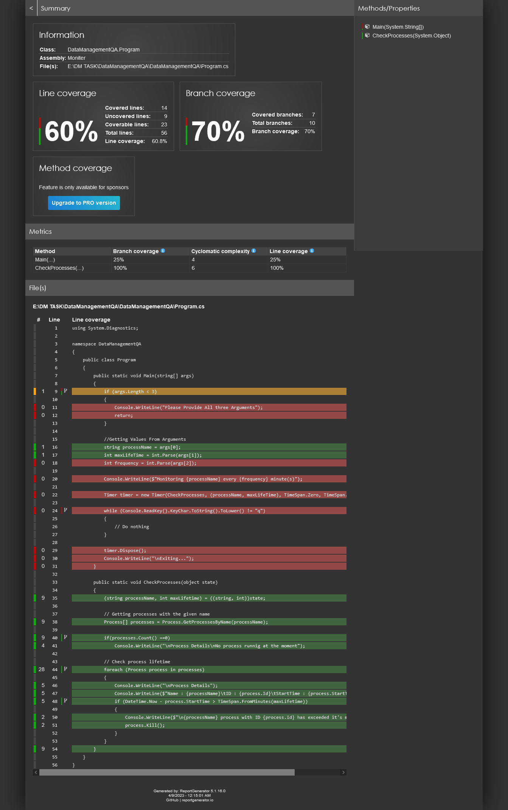
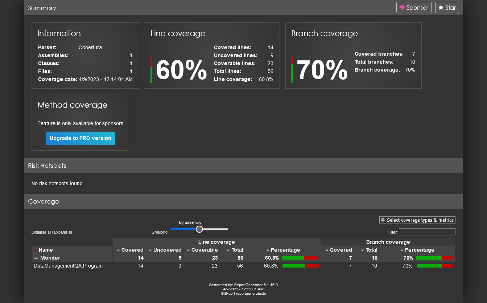

# C-Utility-for-Handling-Processes
C# Console App that checks the app maximum life time and kills the process which exceeds it's particular time. The project also contains Nunit Test project for testing methods of this console app.

Code Coverage and Reporting (Can be found Under UniTestQA\TestResults\Coverage\Index.html)

