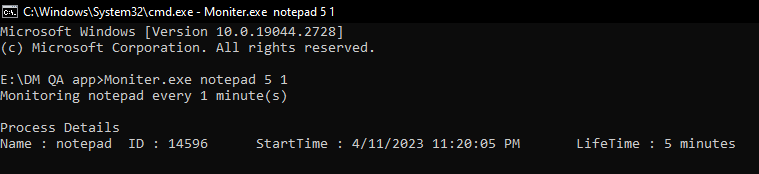
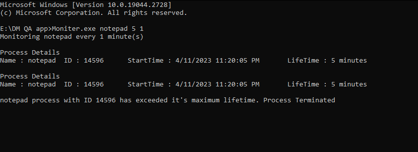
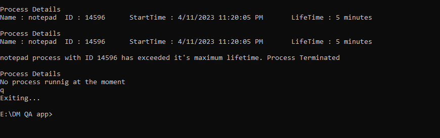

# C-Utility-for-Handling-Processes
C# Console App that checks the app maximum life time and kills the process which exceeds it's particular time. The project also contains Nunit Test project for testing methods of this console app.

The utility expects three arguments from command line 
1. Process Name 
2. Lifetime of Process in Minutes 
3. Frequency of Monitoring Process in minutes

The utility then shows the details of process and checks it after every minutes given in Frequncy parameter

The utility kills the process if it execeeds its maximum lifetime which is given as a second argument.

The program can be exited using q key.

Code Coverage and Reporting (Can be found Under UniTestQA\TestResults\Coverage\Index.html)

